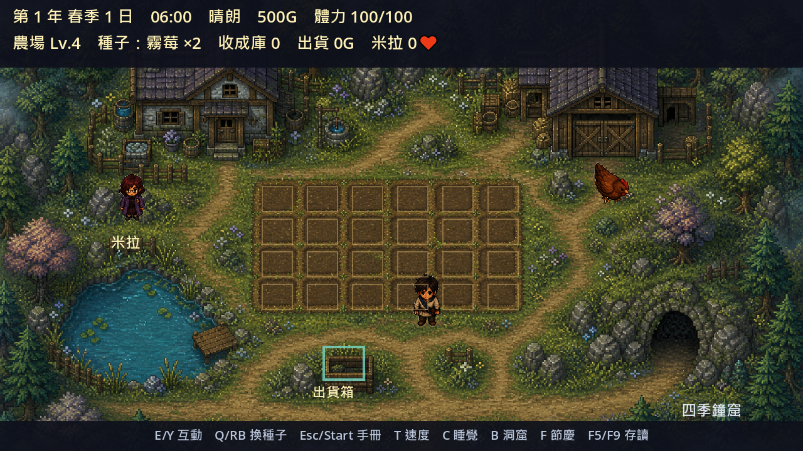

# 霧落農歌：鐘塔之季

《霧落農歌：鐘塔之季》是以 PixelRPG Studio／Godot 4.7.2 製作的繁體中文 Windows／macOS 俯視像素農場動作 RPG。v1.2.1 可完全離線單人遊玩，也能用 Godot ENet／UDP 自行開設最多 16 人的朋友伺服器；遊戲 Runtime 不包含模型、Creator Service、知識庫、遙測或廣告。Steam 設定只作相容性與商業品質基準，目前沒有上傳或發布到 Steam。



## 遊戲內容

- 每季 30 日、一年 120 日、無限年份；快速／標準／悠閒三種日長，主線與戀愛沒有期限。
- 48 種作物、20 種魚（含 8 種異潮漁獲）、40 道料理、雞牛飼養與繁殖、10 級農場、工具升級、商店、出貨及 14 項成就。
- 6×4 自動化設計圖與 9 種鐘能設備；電力／水量網路可自動播種、澆水、收割、餵食、加工霧封農產與凝析夢潮鹽，支援開關、優先序、作物篩選及跨存檔保存。
- 12 場年度節慶，每場有五回合操作、評分、技巧獎勵與前三年不同敘事。
- 10 名主要 NPC、超過 180 段四季／天氣／節慶／好感台詞；4 名不限玩家外觀的戀愛候選、結婚與孩子成長。
- 12 章無期限三年主線，將 10 名村民、農業、關係、鐘窟與異潮釣魚串成同一條動機；第 4 年起保留第三年節慶變體、規則式委託與無限年份經營。
- 鳴鐘河畔、古鐘林與古鐘機械遺跡三張新區域可實際進入、採集、釣魚並遇見排程村民。
- 40 層四季鐘窟、12 種一般敵人、4 名季節守護者、獨立攻擊型態、四枚封印、最終戰與無限挑戰。
- 無星異潮、100 點理智、異魚圖鑑、無期限「潮下的低語」任務，以及使用原創透明像素素材與 16 向彈幕的「克蘇魯之影・溺夢古神」。
- 可在遊戲內開設主機或用 IP 加入；另附無視窗專用伺服器。開服時可選共同農場、私人農場或私人競賽排行，以及獨立戀愛或同一 NPC 的競爭追求。
- 多人劇情依 1 人、2 人、3–4 人、5 人以上切換「獨鐘守望／雙鐘盟約／四季合奏／霧落拓荒議會」；共同、私人、競賽農場與 1／2／3／5／16 人拓撲合計以 7 服 31 客、38 個真實程序驗證版本握手、權威移動、最大容量、農場整合／隔離、四種篇章、戀愛平手／領先／唯一婚約與原子世界存檔。
- 四方向四幀玩家走路動畫、原創角色／敵人／動物圖集、季節與天候效果、程序式離線音樂與音效。
- SaveGame v5；可逐版遷移 v1（28 日制）、v2、v3 與 v4 存檔，保留原季節與日數。

## 下載與遊玩

[GitHub Releases v1.2.1](https://github.com/WhaleChao/mistfall-bell-seasons/releases/tag/v1.2.1)提供 Windows x64 免安裝 ZIP 與 macOS Universal 2 ZIP。Windows 解壓後執行 `Mistfall-Bell-Seasons.exe`；macOS 版同時包含 Apple Silicon（macOS 13 以上）與 Intel（macOS 11 以上）架構，解壓後開啟《霧落農歌：鐘塔之季》App。兩者單人遊玩都不需要網路或 AI 模型。

macOS 成品由 GitHub 的 macOS runner 實際簽署、啟動與觀測離線行為；目前是可驗證的 ad-hoc 簽章，尚無 Apple Developer ID 與 notarization，因此 Gatekeeper 可能要求使用者以右鍵「打開」確認。Windows 亦尚無受公眾信任的 Authenticode 憑證，下載後請以 Release 內的 `SHA256SUMS.txt` 核對。

按 `M`／手把 Select 開啟連線介面，可自行開設主機或輸入 IP 加入；Windows 發行包可雙擊 `Start Dedicated Server.cmd`，macOS 專用伺服器命令見[伺服器指南](SERVER_GUIDE.md)。

原始專案在 Windows 可雙擊 `Play Mistfall.cmd`；macOS 請先安裝 Godot 4.7.2，再雙擊 `Play Mistfall.command`。若 Godot 不在 `/Applications/Godot.app`，可在終端機以 `GODOT_PATH=/完整路徑/Godot.app/Contents/MacOS/Godot ./Play\ Mistfall.command` 啟動。

| 功能 | 鍵盤 | 手把 |
|---|---|---|
| 移動 | WASD／方向鍵 | 左搖桿 |
| 互動／前往下一層 | E | Y |
| 攻擊／翻滾／技能 | J／K／L | A／B／X |
| 切換種子 | Q | RB |
| 遊戲手冊／設定 | Esc | Start |
| 連線主機／加入 | M | Select／Back |
| 節慶活動 | F | L3 |
| 洞窟／返回 | B | R3 |
| 回復藥水 | H | LB |
| 時間速度／睡覺 | T／C | 十字鍵左／右 |
| 快速存檔／讀檔 | F5／F9 | 十字鍵上／下 |

鍵盤滑鼠已完成實際遊戲視窗全流程驗收。這台測試機沒有實體手把，因此表中的 XInput 欄位只證明映射與重綁契約；若日後建立 Steam 頁面，也只能標「部分控制器支援」，不可宣稱完整控制器支援或 Steam Deck Verified。

## 遊玩指南

- [完整攻略](docs/GAMEPLAY_GUIDE.md)：農場、探索、關係、主線與多人系統的玩家向說明。
- [零基礎使用導覽](docs/BEGINNER_GUIDE.md)：原始專案啟動、PixelRPG Studio 與第一小時流程。
- [多人伺服器指南](SERVER_GUIDE.md)：遊戲內開服、專用伺服器與 UDP 網路設定。

## 驗證與建置

```powershell
.\launcher\Fetch-Godot.ps1
.\launcher\Fetch-ExportTemplates.ps1
.\launcher\Setup-PixelRPG.ps1 -WithDocuments -WithVector -WithTestTools
.\launcher\Build-CreatorService.ps1
.\launcher\Test-PixelRPG.ps1
.\launcher\Test-PackagedDocuments.ps1
.\launcher\Test-RealAI.ps1 -CreatorExecutable .\creator_service\dist\PixelRPGCreatorService.exe
.\launcher\Test-StudioUI.ps1
.\launcher\Test-RenderPerformance.ps1
.\launcher\Test-SteamCandidate.ps1
.\launcher\Run-FullAcceptance.ps1
.\launcher\Test-Multiplayer.ps1
.\launcher\Export-macOS.ps1
.\launcher\Package-Release.ps1 -MacOSArchivePath .\dist\Mistfall-Bell-Seasons-v1.2.1-macOS-Universal.zip
.\launcher\Test-PublishedRelease.ps1 -Tag v1.2.1
.\launcher\Test-CodeSigningPipeline.ps1
```

發行閘門會驗證 299 筆內容、JSON Schema／引用、資產 SHA-256／授權、13 張 Runtime 圖片與 2 張透明向量 UI 圖示、Save v1→v2→v3→v4→v5、12,000 日／100 年、12,000 個自動化週期、400 次自動化月存檔、250 次磁碟存讀、20 敵人效能、五種解析度、PCK 邊界與正式 ZIP。非 headless 的[全功能實機驗收報告](reports/full_feature_acceptance/REPORT.md)以真實 macOS 遊戲視窗驅動輸入與 UI，全項通過並保存 20 張畫面；[圖片閘門](reports/image_integrity/REPORT.md)共 794 項，檢查 47 張遊戲／Studio／解析度／去背對比／宣傳畫面。[Steam 品質基準](reports/steam_candidate/REPORT.md)通過 51/51，但只作檢查、不執行上傳。[多人連線證據](reports/multiplayer_acceptance.json)由 38 個獨立 Godot 程序完成農場自動化整合／隔離、四種篇章、戀愛競爭及原子世界保存。正式版預設離線；公開成品另由全新 GitHub Runner 重新下載、核對、解壓、啟動並驗證零網路端點。

## PixelRPG Studio 與本機 AI

雙擊 `PixelRPG Studio.cmd` 可開啟 15 頁 Godot 編輯插件；Creator Service 可在製作端連接本機 Ollama，產生帶引用、可驗證並需人工套用的草稿。Studio 已通過 [57 項實機 UI 驗收](reports/studio_ui/REPORT.md)，最終封裝服務已通過 [24 項真實 AI 驗收](reports/real_ai_packaged/REPORT.md)與 [9 種文件／OCR／sqlite-vec 離線索引](reports/packaged_documents/REPORT.md)。AI 工具與設計文件由匯出規則硬性排除，不會跟著遊戲發布。

## 授權與隱私

程式碼採 [MIT License](LICENSE)。原創生成素材的來源、SHA-256 與 `LicenseRef-OpenAI-Generated` 記錄於 `data/assets/index.json`，第三方政策見 [THIRD_PARTY.md](THIRD_PARTY.md)；Windows 與 macOS ZIP 都附 Godot 4.7.2 的完整授權與第三方著作權原文。遊戲不收集遙測；只有玩家主動開服或加入時才建立 ENet 連線，詳見 [PRIVACY.md](PRIVACY.md)。
