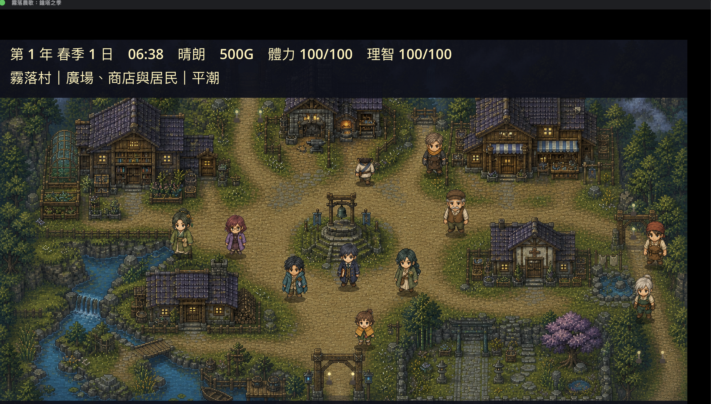
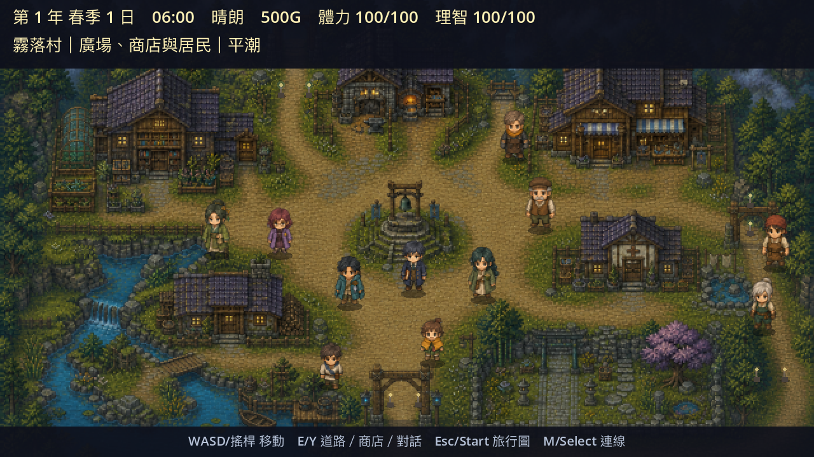
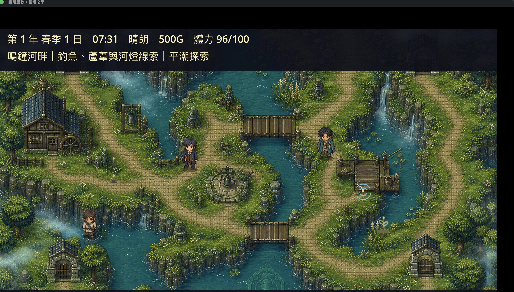
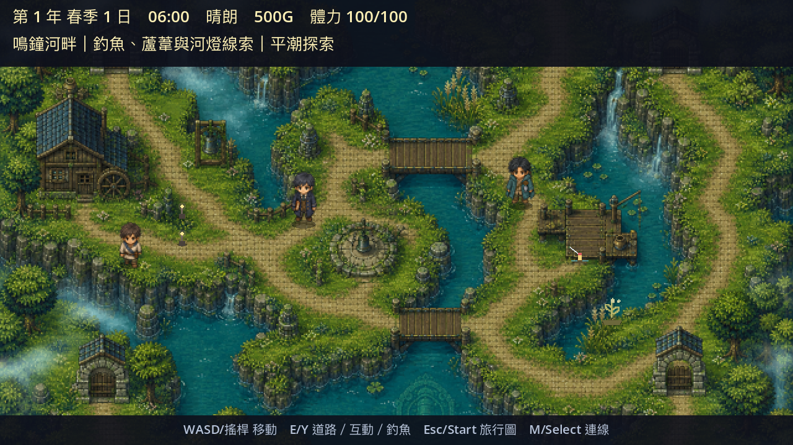
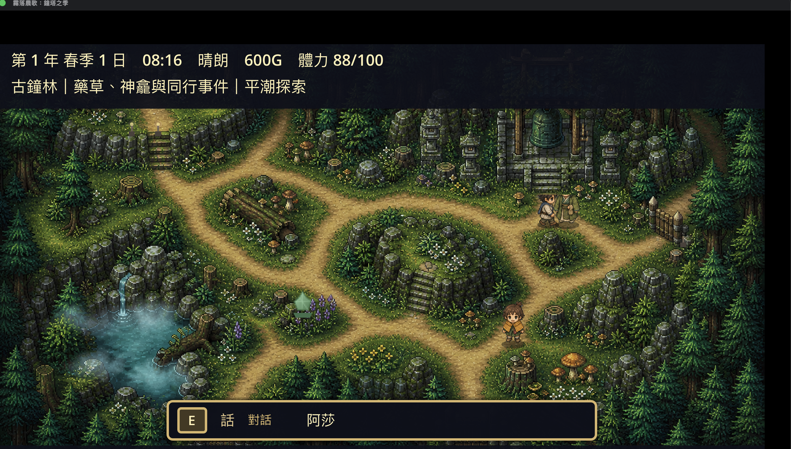
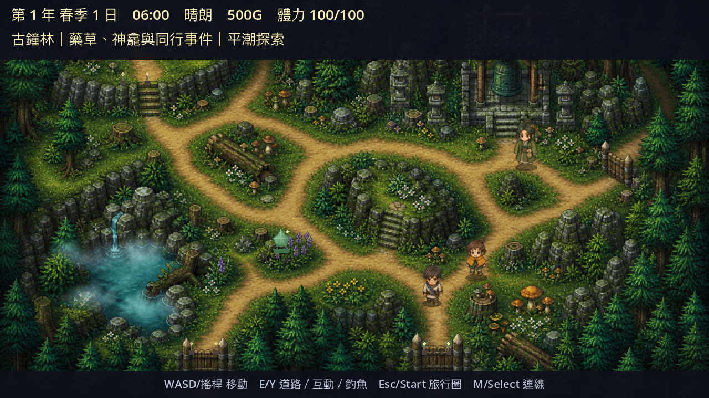
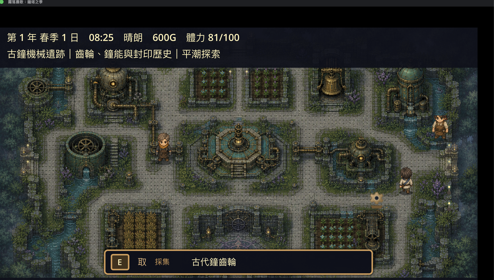
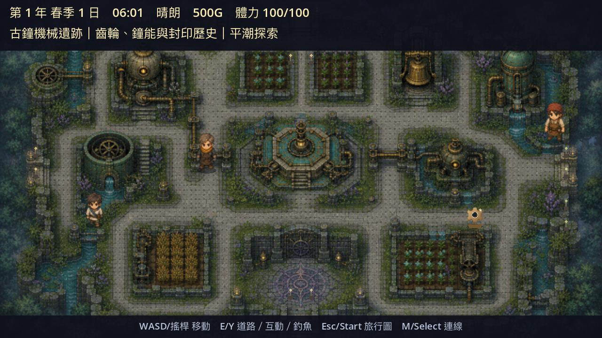

# 全地圖與農場建物重製驗收報告 v2

日期：2026-09-02

目標平台：macOS（Mac16,13／Apple M4／Godot 4.7.2）

結果：通過

## 完成範圍

- 建立 10 個獨立 MapScene：農場、村莊、河畔、古鐘林、古鐘機械遺跡、四季鐘窟、夢岸、農舍、畜舍與溫室。
- 新增 `WorldMapDefinition`、`MapPortalDefinition`、`WorldInteractableDefinition`、`ActorVisualProfile`、`AnimalPresenceState` 與非顯示用 `TileMapLayer` 語意查詢層。
- 戶外碰撞重新沿最終 640×360 背景描繪；建物、機器、河流、湖面、岩壁與樹林不可穿越，橋、道路、門、碼頭與合法淺灘保留通行。
- 10 張地圖的所有可走格都屬於同一可達元件；所有傳送門具有反向定義，村莊、河畔、古鐘林與古代都市可直接互通，不必先繞回農場。
- 農舍提供雙向門、床、廚房與共用儲物箱；睡眠只能在床邊觸發。畜舍提供動物、餵食槽、畜產品箱與場景內鐘網控制台。溫室未解鎖時會說明條件，解鎖後有 12 格全年栽培床。
- 動物依天候與 08:00–18:00 時段只出現在戶外牧區或畜舍其中之一；SaveGame v6 保存地圖、門、位置、面向、室內狀態與動物位置，v1～v5 可遷移。
- 角色、NPC、動物、敵人與頭目統一使用腳底中央錨點、Y-sort 及最終尺寸圖集；移除站立漂浮、呼吸縮放與建立順序造成的互相遮蓋。
- 世界文字改為單一底部互動提示；移除常駐地名、同心圓、箭頭陣列、顛倒字與矩形遮人。洞窟出生點排除牆內、HUD、邊緣與前景遮擋。
- 194 個種子、作物、魚、蛋、藥水、藥草、齒輪、礦石、木材、工具、料理、畜產品與設備視覺 ID 均為獨立 64×64 PNG；缺圖會使內容閘門失敗。
- 攻擊具備預備、命中與收刀三階段；命中區與刀光共用面向向量，四方向刀光尾端在手部、尖端朝外，不會向主角身體發射。

## 場景與人物比例契約

| 類型 | 最終單格尺寸 | Runtime 縮放 |
|---|---:|---:|
| 主角 | 47×47 px | 1.0 |
| 一般 NPC | 52×52 px | 1.0 |
| 雞 | 47×47 px | 1.0 |
| 家畜 | 58×58 px | 1.0 |
| 一般敵人 | 48×51 px | 1.0 |
| 頭目 | 60×64 px | 1.0 |

一般角色高度最大／最小為 58／47＝1.234，小於 1.25 的驗收上限。背景固定 640×360，顯示只做整數倍縮放；角色不使用小數縮放。腳底碰撞點、接觸陰影及 Y-sort 原點一致，門高約為一般角色的 1.6～2 倍，床、橋、家具與機器維持同一視覺比例。

## 自動驗收

| 閘門 | 結果 |
|---|---|
| World v2 行為驗收 | PASS：10 地圖、農舍 100 次、畜舍 100 次、194 視覺 ID |
| 實際物理可達性 | PASS：10/10 地圖，所有可走格連通率 1.000 |
| 雙向傳送圖 | PASS：每個 portal 都有合法反向連線與未阻擋出生點 |
| 睡眠／溫室／動物 | PASS：床外不可睡、鎖定遷移安全、動物不重複 |
| 攻擊方向與階段 | PASS：四方向、5 個刀光進度取樣、共同命中向量 |
| 固定畫面回歸 | PASS：10/10 張，1280×720 證據圖 |
| 內容與授權 | PASS：299 內容、runtime 資產 SHA-256、194 icon manifest |
| Python 內容測試 | PASS：12/12 |
| macOS 實機耐久 | PASS：300.004 秒、18,001 幀、858 次攻擊 |

Mac 實機耐久報告位於 [`mac_soak.json`](mac_soak.json)：平均 60.0 FPS，最低一秒取樣 59.8 FPS；10 張地圖均巡迴，快速存檔與讀檔均成功。固定截圖清單與 renderer 記錄於 [`visual_report.json`](visual_report.json)。

## 前後對照

### 村莊

### 河畔

### 古鐘林

### 古代都市

其餘完成畫面：[`農場`](after/01_farm.png)、[`鐘窟`](after/06_depths.png)、[`夢岸`](after/07_dreaming_shore.png)、[`農舍`](after/08_farmhouse.png)、[`畜舍`](after/09_barn.png)、[`溫室`](after/10_greenhouse.png)。

## 採用的開源設計參考

- [Godot Demo Projects](https://github.com/godotengine/godot-demo-projects)：MapScene、Area2D、TileMapLayer 與 AStarGrid2D 的資料語意及測試方式。
- [Godot 官方 RPG Demo](https://github.com/godotengine/godot-demo-projects/tree/master/2d/role_playing_game)：玩家、地圖、互動、戰鬥與 UI 的責任分離。
- [GDQuest Open RPG](https://github.com/gdquest-demos/godot-open-rpg) 與 [GDQuest A-RPG](https://github.com/gdquest-demos/godot-make-pro-2d-games)：場景載入、持久狀態與轉場概念。
- [Godot Town Demo](https://github.com/odylic/godot-town-demo)：保存來源門與回程位置的行為參考；程式重新實作，未搬用素材。
- [Godot Valley](https://github.com/RezaTaheri01/godot-valley)：農耕、工具、釣魚及資料驅動結構；只採 MIT 設計模式，未搬用第三方美術。

所有新增室內圖的原始輸出與來源記錄位於 `assets/source/generated/interiors/`；角色最終尺寸衍生規則位於 `assets/runtime/sprites/FINAL_SIZE_PROVENANCE.md`。正式 runtime 不包含參考專案的程式或美術檔。

## macOS 成品

macOS Universal 2 ZIP 已在本機產出：`dist/world-v2/Mistfall-Bell-Seasons-v1.2.1-macOS-Universal.zip`（82 MB）。

- SHA-256：`d46cdd8a680f87557abf73fd9d72c1701128c64e1e98362a7a6fbfeed63647cf`
- 架構：`x86_64`、`arm64`
- 最低系統：Intel macOS 11.0、Apple Silicon macOS 13.0
- 封包稽核：PASS；PCK、版本、bundle identifier、執行權限與 11 份授權／操作文件均完整
- 實際匯出程式啟動：PASS；Godot 4.7.2 啟動後無 script、resource 或 engine error
- 簽章：ad-hoc 簽章且 `codesign --verify --deep --strict` 通過；尚未使用 Apple Developer ID、未 notarize

完整結果見 [`macos_archive_audit.json`](macos_archive_audit.json) 與 [`macos_archive.sha256`](macos_archive.sha256)。`dist/` 不納入 Git 版本控制，成品保留在本機工作區。
